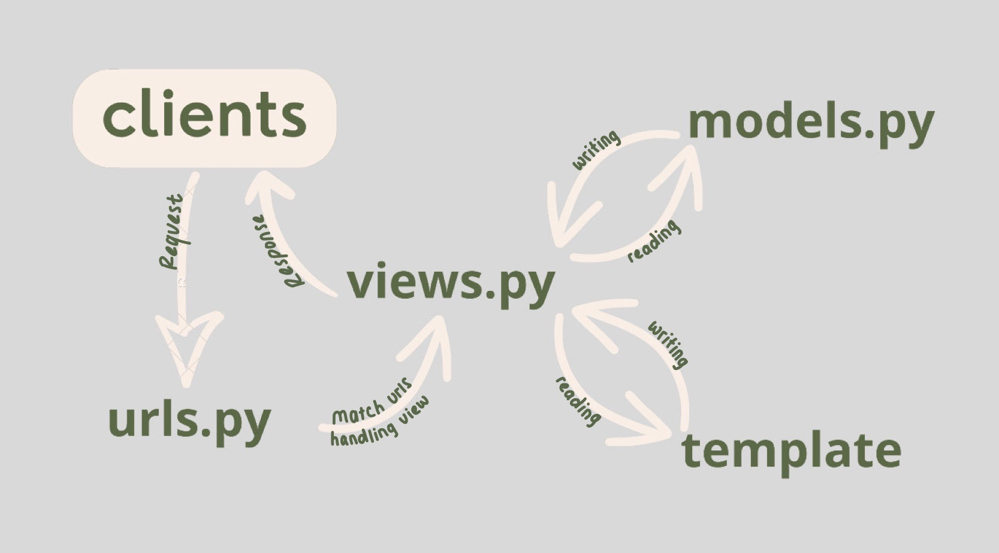
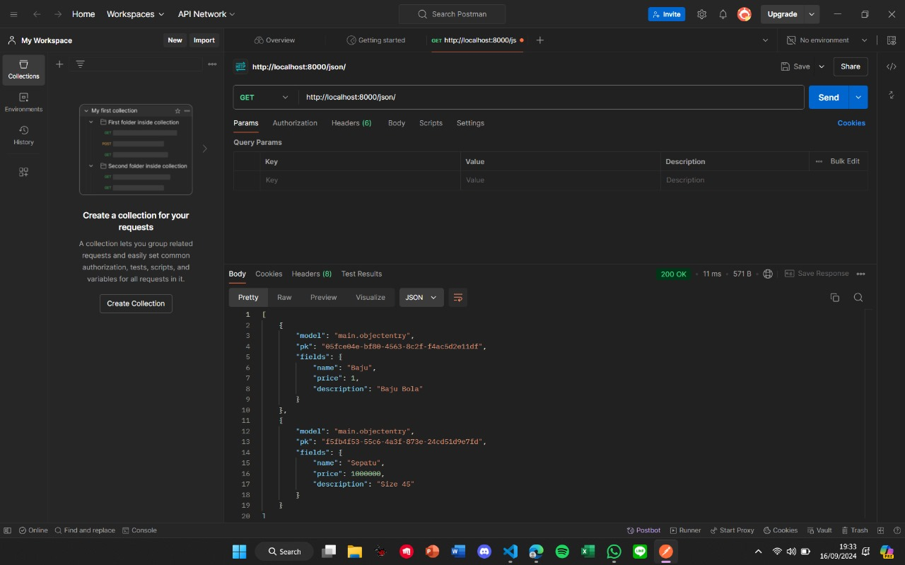
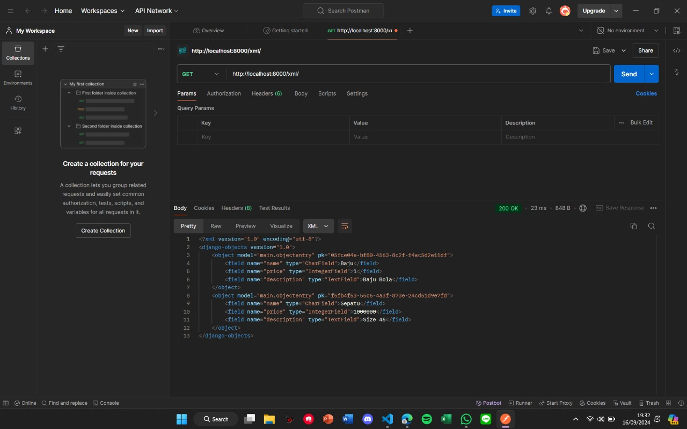
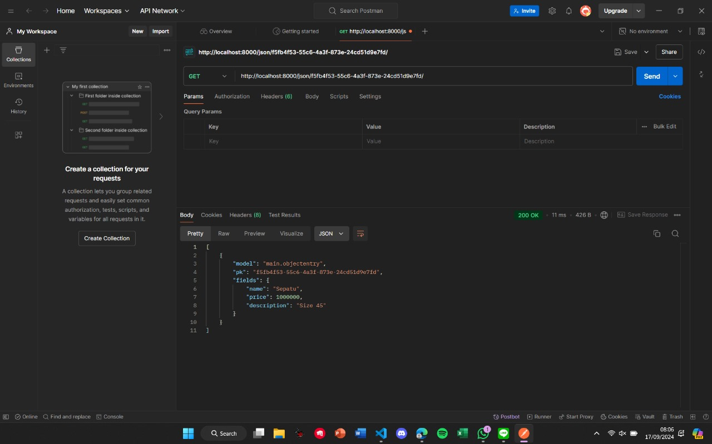
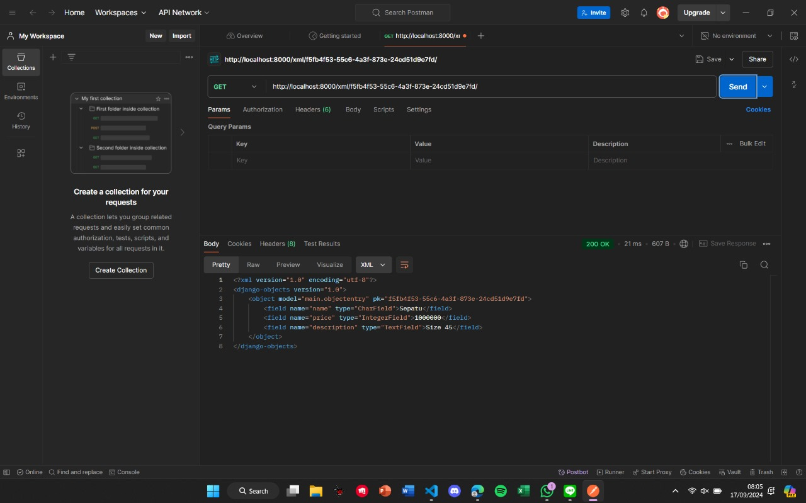

**DFootball**
---------------------------------------------------------------
**Assignment 2**
**link_deploy = darren-marcello-darrenecommerce.pbp.cs.ui.ac.id**

**1. Explain how you implemented the checklist above step-by-step (not just following the tutorial).**
   1. Make a new Django project:
   Run django-admin startproject ecommerce
   2. Make an application named main :
   Run python manage.py startapp main (to create the application like views.py, models.py and urls.py)
   3. Run routing for "main" app:
   add this in the urls.py

    
    from django.urls import path, include
    urlpatterns = [
        path('', include('main.urls')),
    ]
   4. Make a product model :
    Define the models in models.py name with a character field with the max length of 100, price with and IntegerField, and description with a Text Field.

  ```
   from django.db import models
    class Item(models.Model):
        name = models.CharField(max_length=255)
        price = models.IntegerField()
        description = models.TextField()
        def __str__(self):
            return self.name
   
   ```
    After defining the model, run : 
    python manage.py makemigrations
    
   5. Make html file :
      In main directory, create a html file named main in the main.html and input this. 
```
    <h1>DFootball Store</h1>
    <h5>Name app: </h5>
    <p>{{ name_app }}</p> <!-- Change according to your npm -->
    <h5>Name: </h5>
    <p>{{ name }}</p> <!-- Change according to your name -->
    <h5>Class: </h5>
    <p>{{ class }}</p> <!-- Change according to your class -->
    <h5>Sepatu: </h5> 
    <p>Price : Rp.100.000</p> 
    <p>Description : Sepatu Bola Nike Mercurial</p> 
    <h5>Jersey </h5> 
    <p>Price : Rp.1.000.000</p> 
    <p>Descritpion : Jersey Real Madrid</p>
    <h5>NameSet Baju Bola: </h5> 
    <p>Price = Rp 50.000</p> 
    <p>Description : Ronaldo 7</p> 
```


   6. Create a view in views.py :
    This is for display your name and class.This is for handle an HTTP  request and returns the appropriate view, and will pass the data from context dict. In views.py, define a function 

    from django.shortcuts import render
    def show_main(request):
        context = {
            'name': 'Darren Marcello Sidabutar',
            'class': 'PBP KKI',
            'name_app': 'E-Commerce',
        }

        return render(request, "main.html", context)

   7. Route the view in urls.py :
    In urls.py of the main app, write this code

    from django.urls import path
    from main.views import show_main

    app_name = 'main'

    urlpatterns = [
        path('', show_main, name='show_main'),
    ]

   8. Deployin to PWS :
    Access the PWS at https://pbp.cs.ui.ac.id and login into your account. Create a new project, and store it. Add the PWS deployment URL to allowed host in settings.py

    ALLOWED_HOSTS = ["localhost", "127.0.0.1", "<your pws deploy url>"]
    Run the project command instruction in the PWS page.

**2. Create a diagram that contains the request client to a Django-based web application and the response it gives, and explain the**
relationship between urls.py, views.py, models.py, and the html file.


**3. Explain the use of git in software development!**
Git is a version control that allowing developers to track changes in their codebase, collaborate with others, and manage code history of all modifications. And it supports teams to work on different branches for working on a new features without affect the codebabase and merge their work efficiently for integrating those features without problem.

**4. In your opinion, out of all the frameworks available, why is Django used as the starting point for learning software development?**
Django is a high-level Python framework that promotes rapid development with clean and pragmatic design. It handles much of the heavy lifting, such as routing, database management, and user authentication, which makes it a good starting point for beginners to focus on learning core development concepts without getting lost in the complexity of lower-level details.

**5. Why is the Django model called an ORM?**
Django's models are an ORM (Object-Relational Mapping) system. It allows developers to interact with databases using Python objects. It simplifies management of database operations while keeping the flexibility to handle complex queries when needed.


**--------------------------------------------------------------------**

Assignment 3

**1. Explain why we need data delivery in implementing a platform.**
 Data delivery is critical in platform implementation because it allows information to be transferred between systems, users or others. The platform cannot interact with external services without efficient data delivery, and it provides real-time updates, or maintains a consistent user experience. And data delivery can ensure that various platform components can communicate with each other properly.

**2. In your opinion, which is better, XML or JSON? Why is JSON more popular than XML?**
In my opinion, JSON is better than XML. The reason is that JSON is easier to read because its syntax is easier to understand. JSON also produces smaller data loads so it is more bandwidth efficient. JSON is becoming more popular than XML in web development, because of its compatibility with JS and wide adoption in modern frameworks.

**3. Explain the functional usage of is_valid() method in Django forms. Also explain why we need the method in forms.**
The is_valid() method is used to validate form data, and check whether the data provided by the user matches the requirements of the form fields.

If the data is valid, is_valid() returns True and also populates the cleanse_data attribute, which stores the cleaned form data.
If the data is invalid, is_valid() returns False and stores the error message in the errors attribute.

We need this method to ensure that the data submitted through the form is correct and safe to use before processing it. Without proper validation, the platform can face issues such as storing invalid data, security vulnerabilities, or crashes.

**4. Why do we need csrf_token when creating a form in Django? What could happen if we did not use csrf_token on a Django form? How could this be leveraged by an attacker?**
The csrf_token is used to prevent Cross-Site Request Forgery (CSRF) attacks. A CSRF attack occurs when an attacker tricks a user into taking an action they don’t want to take, such as submitting a form on their behalf without their knowledge.

Without the crsf_token, an attacker could cause unauthorized actions, such as changing account information or executing transactions without the user’s consent, by exploiting the lack of protection by creating a malicious form that automatically submits data to your site on behalf of an unsuspecting user.

**5. Explain how you implemented the checklist above step-by-step (not just following the tutorial).**
1. Create a form input to add a model object.
    1. Create a new file in the main directory with the name forms.py and add the following code :
    ```
    from django.forms import ModelForm
    from main.models import ObjectEntry

    class ModelObjectForm(ModelForm):
        class Meta:
            model = ObjectEntry  #indicate the model that will be used for the form.
            fields = ["name", "price", "description"] #indicate the fields of the ObjectEntry model.
    ```

    2. Open the views.py and add this code :
    ```
    from django.shortcuts import render, redirect
    ```

    3. Create a new function with the name model_object and add the following code below :
    ```
    def model_object(request):
    form = ModelObjectForm(request.POST or None) #is used to create a new MoodEntryForm with the input from the user in request.POST entered into the QueryDict.

    if form.is_valid() and request.method == "POST": #is used to validate the input from the form.
        form.save() #is used to create and save the data from the form.
        return redirect('main:show_main') #is used to perform a redirect to the show_main function in the main application's views after the form data is successfully saved.

    context = {'form': form}
    return render(request, "create_model_object.html", context)
    ```
    the function is to produce a form that can automatically add a ObjectEntry data when data is submitted.

    4. Change the show_main function in the views.py :
    ```
    def show_main(request):
    object_entries = ObjectEntry.objects.all() #retrieve all objects of the ObjectEntry objects stored in the database.
    context = {
        'name': 'Darren Marcello Sidabutar',
        'class': 'PBP KKI',
        'name_app': 'E-Commerce',
        'object_entries': object_entries
    }
    print(object_entries)

    return render(request, "main.html", context)
    ```
    5. Open the urls.py file in the main directory and import the model_object function.
    ```
    from main.views import show_main, model_object
    ```
    6. Add the URL path to the urlpatterns variable in the urls.py :
    ```
    path('model-object', model_object , name='model_object'),
    ```
    7. Create a new HTML file with the name create_model_object.html in the main/templates directory and fill in with the following code.
    ```
     
    
    <h1>Add Item</h1>

    <form method="POST">
    
    <table>
        {{ form.as_table }}
        <tr>
        <td></td>
        <td>
            <input type="submit" value="Add Item" />
        </td>
        </tr>
    </table>
    </form>

    
    ```    
    8. Open the main.html and add the following code within the  block :
    ```
    
    <p>There are no object data in DFootball Store.</p>
    
    <table>
    <tr>
        <th>name</th>
        <th>price</th>
        <th>description</th>
    </tr>

     This is how to display object data
     
    
    <tr>
        <td>{{model_object.name}}</td>
        <td>{{model_object.price}}</td>
        <td>{{model_object.description}}</td>
    </tr>
    
    </table>
    

    <br />

    <a href="">
    <button>Add Item</button>
    </a>
    
    ```
    it is to display the data in the form in the form of a table and the "Add Item" button.

    9. Run the Django project 

2. Add 4 views to view the added objects in XML, JSON, XML by ID, and JSON by ID formats.
    1. Open the views.py and add the HttpResponse and Serializer imports.
    ```
    from django.http import HttpResponse
    from django.core import serializers
    ```
    2. Create a new function that receives a parameter request with the name show_xml and create a variable in the function itself that stores the result of the query of all data in the MoodEntry.
    ```
    def show_xml(request):
    data = ObjectEntry.objects.all()
    ```
    3. Add the return function as an HttpResponse that contains the serialised data result as XML and the content_type="application/xml".
    ```
    def show_xml(request):
    data = ObjectEntry.objects.all()
    return HttpResponse(serializers.serialize("xml", data), content_type="application/xml")
    ```
    4. Open the urls.py file in the main directory and import the function that you just created.
    ```
    from main.views import show_main, model_object, show_xml
    ```
    5. Add the URL path to the urlpatterns variable in the urls.py file in the main directory to access the function that was imported in the previous point.
    ```
    path('xml/', show_xml, name='show_xml'),
    ```
    6. Open the views.py file in the main directory and create a new function that receives a parameter request with the name show_json with a variable in the function itself that stores the result of the query of all data in the MoodEntry.
    ```
    def show_json(request):
    data = ObjectEntry.objects.all()
    ```
    7. Open the urls.py file in the main directory and import the function that you just created.
    ```
    rom main.views import show_main, model_object, show_xml, show_json
    ```
    8. Add the URL path to the urlpatterns variable in the urls.py file in the main directory to access the function that was imported in the previous point.
    ```
    path('json/', show_json, name='show_json'),
    ```
    9. Add the return function as an HttpResponse that contains the serialised data result as JSON and the content_type="application/json".
    ```
    def show_json(request):
        data = ObjectEntry.objects.all()
        return HttpResponse(serializers.serialize("json", data), content_type="application/json")
    ```
    10. Run the Django project with the python manage.py runserver command and go to http://localhost:8000/json/ and  http://localhost:8000/xml/ in your browser of choice to see the result.

    11. Open the views.py file in the main directory and create two new functions that receive a parameter request and id with the names show_xml_by_id and show_json_by_id. And Create a variable in the function itself that stores the result of the query of data with the specific ID that exists in the ObjectEntry, and add the return function as an HttpResponse that contains the serialised data result as JSON or XML and the content_type with the value "application/xml" (for XML) or "application/json" (for JSON).

    XML :
    ```
    def show_xml_by_id(request, id):
    data = ObjectEntry.objects.filter(pk=id)
    return HttpResponse(serializers.serialize("xml", data), content_type="application/xml")
    ```
    JSON :
    ```
    def show_json_by_id(request, id):
        data = ObjectEntry.objects.filter(pk=id)
        return HttpResponse(serializers.serialize("json", data), content_type="application/json")
    ```
    12. Open the urls.py file in the main directory and import the function that you just created.
    ```
    from main.views import show_main, create_mood_entry, show_xml, show_json, show_xml_by_id, show_json_by_id
    ```
    13. Add the URL path to the urlpatterns variable in the urls.py file in the main directory to access the function that was imported in the previous point.
    ```
    path('xml/<str:id>/', show_xml_by_id, name='show_xml_by_id'),
    path('json/<str:id>/', show_json_by_id, name='show_json_by_id'),
    ```
    14. Run the Django project with the python manage.py runserver command and go to http://localhost:8000/xml/[id]/ or http://localhost:8000/json/[id]/.


3. Create URL routing for each of the views added in point 2.


**6. Access the four URLs in point 2 using Postman, take screenshots of the results in Postman, and add them to README.md.**



